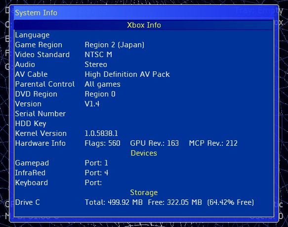

# Introduction

UnleashX is an Xbox Application/Game launcher, with a few other features thrown in. I've designed UnleashX with safety in mind. I intentionally left out any feature that could potentially render your xbox useless, except for the HD formatting.
This dash has been tested on V1.0, V1.1 and V1.4 xboxes with X2 4976.02/4977/4979/4981, Evox D6/M7 BIOS.

## Features

UnleashX has the basic feature of a dashboard. It can automatically search your HD, or DVD if run from it (though you should not let it search the DVD for speed reason). Here is a small list of the current feature of UnleashX:

1) Auto search for games/application with thumbnail for display. Searches and indexes your hard drive for Xbox titles. Uses icon embedded within the xbe file or custom icon (Icon.png, Icon.jpg).
2) File manager (Copy/Move/Delete/QuickDVDCopy/XBE Title editor, Support for copy and resume so you don't start from the beginning if an error occurs).
3) Game/DVD movie/CD/Data detection with the option to autolaunch them using your favorite media player. Pressing any of the trigger buttons will suppress auto launching of disk.
4) Image viewer (bmp, jpg, xbx and xpr) built in to the File manager.
5) Zip/Unzip files right from your xbox. Supports extracting from Xbox Xip files (except xm files). Now you can check the contents of the xip files that came with the xbox without leaving it.
6) Auto/Manual clock settings. You can set it to manual so UnleashX ask you for date and time when it becomes invalid (i.e., it has been unplug for too long). If set otherwise, UnleashX will set it Nov 15, 2003.
7) Password protection for every item. With UnleashX, you can set a password for each menu, submenu, individual item, as well as a system password with maximum number of tries (only for system password. When the maximum is reached, the Xbox will automatically shutdown). The format menu has a default password of Xbox with a capital X.
8) Color scheme. You can change the colors of all items, from the menu color, to the screen dialog, down to the default background and fog color.
9) Fully configurable (XML config file). To achieve flexibility, XML is used almost everywhere. It's a pretty flexible format but it's not an all and be all solution.
10) Widescreen support (HDTV and support for 480p was not tested).
11) FTP Server with PASV and multi-client (10 max) support. You can set the Username, password, port, maximum number of users, anonymous access). While UnleashX supports multiple clients simultaneously, all users must use the same user account (default is Xbox).
12) Simple screen saver and Auto-Turn off timer.
13) Sound effects (uses internal xbox files -- it will still run without them) and uses the soundtrack for background music. The combination for changing the music is **White** + **DpadLeft** = Next song, **White** + **DpadRight** = Previous song, **White** + **DpadDown** = Next soundtrack, **White** + **DpadUp** = Previous Soundtrack. And/or Music can also be controlled using the IR. Play, Pause, Stop, Forward (next song), Reverse (prev. song), Skip+(next Soundtrack), Skip -- (prev. soundtrack).
14) In-box configuration, so you don't need to do everything from your PC.
15) USB Keyboard and IR support (Pressing the Display on the IR for more than 1.5 seconds will turn the xbox off -- though it's probably faster to just select the power-off menu item).
16) Virtual Keyboard support for all settings.
17) Support for Memory Unit thru File manager and FTP server. You can browse and copy/transfer files between your Xbox hard disk and memory unit.
18) Partition Formatting.
19) Screen Capture. And with the built in image viewer, you can now view it too (though what's the point?). Key combo -- **Left Thumbstick** press + **Black** Button. Look for the images in `Z:\` (or `Y:\`, if Z happens to be full, then `X:\` if Y happens to be full or not available).
20) Extensive support for skinning. You can switch skin without restarting. Now supports preview and you don't have to unpack your skin files anymore. Just zip them up, and upload to your Skins folder (each zip file must be on its own subfolder and all files must be in the root of the zip file -- meaning select the files when zipping and not the folder containing the files).
21) RSS News feed support. To cycle news items press (**Black** + **DPad Right**).
22) Supports batch command.
23) Support for partition G.
24) To keep the footprint small, UnleashX uses a lot of files that are already in your HD like the sound effects file and xbx files. If you have a hacked MS dash, you'll probably notice this as long as you didn't rename them to something else.
25) Unrar (works with V2.0 Rar only -Winrar 2.9). Rar 3.0 can be displayed but can't be extracted.
26) Video Support (WMV8 and XMV only). You can now watch that WMV/XMV cut scenes without playing the game. Just select your movies from the file manager and watch. **Right Thumbstick** (press) toggles between windowed and fullscreen view. See skinning overview to learn how to use video on your skins. For an automatic preview video detection, name your video "`preview.xmv`" or "`preview.wmv`" and drop them in the game folder. Preview videos con be found at [http://www.gametrailers.com/](http://www.gametrailers.com/) as well as `#mxmfiles` on EFNet.
27) Custom music path. If you have WMA's on your xbox aside from those ripped using MS Dash, you can tell UnleashX where to look for them. It will search the path you pointed and one folder down, if any.
28) Skin preview. Provide a screenshot and save it as "`preview.jpg`" to enable skin preview. It's off by default. Press the **White** button to toggle preview mode. You can also preview the skin live and restore the settings on next bootup. When in the Skin Selection screen, press the **Back** button. This should tell UnleashX to use the selected skin until the next reboot. To use the selected skin all the time, press **A** for the second time, or **B** or **Black** buttons.
29) Skin files need not be expanded any more. Zip up your files, upload in its own folder, and select it.
30) Safe mode. Some skins crashed UnleashX? Just reboot your xbox and select another one without using a boot disk. UnleashX should bypass it on the next reboot. Same goes true for `config.xml`.
31) Capability to format new Harddisk and restore backup when run from CD-R/RW or DVD. See `hdprepare_movie.txt` for details. Thanks to Modchip­Source ([www.modchipsource.com](www.modchipsource.com)) for providing the HD used for testing.
32) Capability to Delete a single file or a directory recursively -- **please be cautious and don't blame me for lost data**. Deleting from action command **WILL NOT ASK** for your confirmation.
33) XBE Title editor. Find and highlight your xbe using the File manager, bring up the menu, and find "Rename XBE Title" option. -- The dash will detect if an XBE was modified at boot up time -- then updates the cache to reflect info. (Should now update the title when you use XBERenamer, or any XBE-editing tool).
34) Enable/disable Preview video via the **Black** button (only for skins that uses preview videos).
35) Windowed/Full screen mode for preview video via **Right Thumbstick** press, or Display on the IR control. (Menu items will still show up when in full screen mode).
36) Integrated Text editor. Now you can edit those `.txt`, `.ini`, and `.xml` files straight from the box without leaving the dash. Find your text file from the File manager and select it. Thank to the author of xPad for his "Tab char" idea.
37) Video mode Auto-Detect/Auto-Switch using Cherry's dynamic kernel patching code so it's EEPROM safe (Doesn't modify/write to EEPROM chip). Force PAL60 option is also included. A simple reboot reverts everything back to original settings.
38) Dynamic fan speed adjustment base on CPU temperature.

At the moment, there's not much feature but I plan to keep an adding more as I go about it. Here are some features I'm planning to include, but not limited to:

1) FTP client for your xbox to xbox transfer needs.
2) SMTP (outgoing mail client) so you can send email right from your xbox. (Though it's gonna be a pain in the *** with just the virtual keyboard).
3) More in-box settings. Xbe renaming, temporary (via cache). Adding/modifying password for all menu items is also being planned.
4) Game save manager.
5) Custom soundtrack support.
6) And a lot more....

## Installation Instructions

If you are to use this application for the first time, I suggest you use it as an application first before using it as a full time default dashboard, just so you get used to it. FTP the `default.xbe`, along with the `config.xml` (optional) to your hard drive, or make an xISO image file and burn it to a media (CD-R/W, DVD±R/W) that your drive can read. Then point your evox/mxm/ava/MS h4xx0r3d dash/nexGen to it and use it for a while (usually in `E:\` or `F:\` under `Apps\UnleashX\default.xbe`). Before FTP'ing it in, go ahead and open the `config.xml` and edit it to your liking. (i.e. IP address, fan speed). Note that everything can be configured straight from inside this dash. Then when you're comfortable, rename your stock dash to something else and stick in the `default.xbe` and `config.xml` in your `C:` drive and rename it to what your old dash use to be named. Most common name for a replacement dashboard is `evoxdash.xbe` but it seemed BIOS maker changed the rule, so read the docs that came with your favorite BIOS provider.

# Config File explained

Here is a sample config file. I'll try to explain it a bit. You can change most of it right from your xbox. UnleashX, like many others, uses xml file for configuration.
Xml files are very flexible yet could become cumbersome if you don't know what you are doing. If you don't know a thing about xml files, you can just accept the default (you can even completely delete it and UnleashX will create one for you with the default settings. As an xml primer, an xml file is nothing more than a text file that consists of tags, attributes and values. In the example below, the Tag is `Item`, attribute is `Action` and `C:\xboxdash.xbe` as the corresponding attribute value, "MS Dashboard" as the tag value and "`/Item`" as the end tag.
```xml
<Item Action="C:\xboxdash.xbe">MS Dashboard</Item>
```

```xml
<!-- Standard XML header (can be omitted) -->
<?xml version="1.0" encoding="utf­8" ?>
<!-- Root node. It has to be UnleashX -->
<UnleashX>
  <Settings>
    <!-- MS dash location -->
    <MSDashBoard>C:\Xboxdash.xbe</MSDashBoard>
    <!-- System password. If you enter something here, UnleashX will always ask you to enter the password before
    you can use your xbox. Of course, if you power up with a game disk in the tray, your xbox will always boot to
    that game. -->
    <Password MaxTries="3">Xbox</Password>
    <!-- Network settings. Default is enabled, using a static IP (detects the current settings and will default to
    192.168.0.5 if it can't find a valid IP. Of course, this config file uses 192.168.1.100. Change it accordingly
    to reflect your network settings (you can do it right from xbox also).
    Valid options Enable:Yes/No, Type:Static/DHCP -->
    <Network Enable="Yes" Type="Static">
      <IP>192.168.1.100</IP>
      <Subnet>255.255.255.0</Subnet>
      <Gateway>192.168.0.1</Gateway>
      <DNS1>192.168.0.1</DNS1>
      <DNS2>192.168.0.7</DNS2>
    </Network>
    <!-- FTP Server Settings. Default is enabled, using port 21, anonymous not allowed, maximum of two clients at
    a time and xbox/xbox for the username/password consecutively. The "greeting" option is just a feature I threw
    in. It's what you'll see from your FTP client after a successful log on.
    The FTP server will report your HD status (free/used/total space) when you request the root folders, which is
    basically the partitions. You can also browse your memory unit. -->
    <FTP Enable="Yes">
      <User>xbox</User>
      <Password>xbox</Password>
      <Port>21</Port>
      <MaxUsers>2</MaxUsers>
      <AllowAnon>No</AllowAnon>
      <Greeting>Welcome to XBOX FTP Server</Greeting>
    </FTP>
    <!-- Newsfeed. Well, I gotta ride on the bandwagon as newsfeeds seem to become a standard feature of
    dashboards nowadays. The rotation interval is in seconds. You can put as many URL as you wish though it will
    have a great impact on the performance of your xbox, I'm sure. Newsfeeds are cached and will only be checked
    once. The cache will be use initially, if present, or if the xbox can't connect to your newsfeed provider.
    Note that even if you enable newsfeeds, it won't be requested if your skin don't use it. -->
    <Newsfeed Enable="False" Interval="30">
      <URL>www.xbox­scene.com/xbox1data/xbox­scene.xml</URL>
      <URL>www.xbins.org/xbins.xml</URL>
    </Newsfeed>
    <Preference>
      <!-- The following settings are pretty basic and deals with auto-launching. -->
      <Games AutoLaunch="Yes" />
      <DVD AutoLaunch="Yes">C:\xboxdash.xbe</DVD>
      <AudioCD AutoLaunch="Yes">C:\xboxdash.xbe</AudioCD>
      <!-- You can leave this to blank to let the built-in file manager open up the disk for you.
      Note that UnleashX only supports disk that are natively supported by Xbox. -->
      <Data AutoLaunch="Yes"></Data>
      <!-- Sound effects volume. Valid values are from 0 to 100 -->
      <SoundVolume>90</SoundVolume>
      <!-- Music volume. Valid values are from 0 to 100 Note if you set this to zero you wont here the humming
      noise in the background. -->
      <MusicVolume>90</MusicVolume>
      <!-- Set this value to make use of your soundtrack. Provide an alternate path to look for your music files
      via the MusicPath attribute. Possible values are:Off, Xbox (to play Xbox Soundtrack), Custom (To play music
      located in MusicPath), Both (to play them both if present) -->
      <EnableSoundTrack Random="True" MusicPath="F:\Music">Both</EnableSoundTrack>
      <!-- Use Fahrenheight when reporting temperature instead of celcius. -->
      <UseFahrenheit>False</UseFahrenheit>
      <!-- If you want to synchronize your xbox with a time server, or with your PC -->
      <SNTP Synchronize="No">192.168.1.1</SNTP>
      <!-- Location of your skins. Relative and absolute path are supported. -->
      <Skin Path="skins\" />
      <!-- If you want to manually set your fan speed. Valid values are 1 to 5 and 0.5 stepping in between
      (1, 1.5, 2, ... 4.5, 5). This may become controversial with the way I have it but there really is no
      standard. It can not be percentage since valid values are 1 to 50 with 10 as the default. While you can
      select an arbitrary number from 1 to 50, it hardly makes any sense so I did it the way I have it.
      1=10, 1.5=15, 5=50 and so forth and so on. You can see this from the settings menu as 1x, 1.5x ... 5x. -->
      <FanSpeed>1</FanSpeed>
      <!-- You can change your LED color (the light surrounding the eject button) to one of this values:
      Default, Red, Orange and Off -->
      <LEDColor>Orange</LEDColor>
      <!-- Note: When using 'Default', the dash will not set it to green on bootup. So, if you modified your BIOS
      to use Red and you chose  'Default', it will stay Red.
      Wait is in seconds, so it will activate after a minute. The Type is not being use right now but I'm planning
      to expand this a bit, probably a few more types, like a slideshow or something which really isn't very hard
      to implement. Right now, it's just a text bouncing around your screen and dimming after a while. -->
      <ScreenSaver Wait="60" Type="1">
        <Text>My Xbox RuLeZ</Text>
      </ScreenSaver>
      <!-- Auto turn of is in minutes. If you put a value here other than zero, UnleashX will turn your xbox off
      with the given time of inactivity. Note that its monitoring any file activity (long copying process,
      FTP activity) and won't fire if your xbox is busy. -->
      <AutoTurnOff>0</AutoTurnOff>
      <!-- If set, UnleashX will mount your partition 6 as drive F. Do not set this to True, if you don't have
      Drive F, it may lock up on you. -->
      <EnableDriveF>True</EnableDriveF>
      <!-- If set, UnleashX will mount your partition 7 as drive G. Do not set this to True, if you don't have
      Drive G, it may lock up on you. -->
      <EnableDriveG>False</EnableDriveG>
    </Preference>
  </Settings>
  <!-- You may have noticed I didn't have settings for date, time and number format. That's because I'm using the
  internal settings of the Xbox to display the information properly.
  Menu layout/settings. The menu settings are consisting of three elements, namely List, Path and Item, List being
  the container of the two. Path isn't visible and is use to tell UnleashX where to search for files. The List
  element can contain several Path, Item or another List element for that drill down effect.
  List element can contain the following attributes:
  - Text      - This is what's displayed
  - Password  - password of the element
  - Sort      - On/Off to turn on/off the sorting of its child elements
  - Auto      - Not being use at the moment.
  - Batch     - executes all child items one by one until it reaches the end of the item list or if one fails.

  Since the List tag is a container, it can not contain a value.
  Path element can only have a value and no attributes. The value should point to a valid location in your HD/DVD
  The Item element can contain attributes and value but not another element. The value is whats being displayed.
  The following are valid attributes for the Item element:
  - Action              - should point to an xbe, or a valid function supported by UnleashX
  - Arg1, Arg2 ... Argn - for arguments required by some inter functions
  - Password            - password for the item

  Lists and Items can also have icons as shown in the LaunchDVD and Games example below.
  Here's a sample menu data: -->
  <Menu>
    <Item Action="LaunchDVD" Password="" Icon ="C:\DVD.png" Preview="C:\DVD.wmv">Launch DVD</Item>
    <List Text="Games" Sort="On" Auto="On" Icon="C:\Games.png" Preview="C:\games.wmv">
      <Path>E:\Games</Path>
      <Path>F:\Games</Path>
      <Path>E:\HDDLoader</Path>
      <Path>F:\HDDLoader</Path>
      <List Text="Action" Sort="On" Auto="On" Icon="C:\Action.png" Preview="C:\Action.wmv">
        <Path>E:\Games\Action</Path>
        <Path>F:\Games\Action</Path>
        <Path>E:\HDDLoader\Action</Path>
        <Path>F:\HDDLoader\Action</Path>
      </List>
      <List Text="Sports" Sort="On" Auto="On" Icon="C:\Sports.png" Preview="C:\Sports.wmv">
        <Path>E:\Games\Sports</Path>
        <Path>F:\Games\Sports</Path>
        <Path>E:\HDDLoader\Sports</Path>
        <Path>F:\HDDLoader\Sports</Path>
      </List>
    </List>
    <List Text="Applications" Sort="On" Auto="On" Preview="C:\apps.wmv">
      <Path>E:\Apps</Path>
      <Path>F:\Apps</Path>
      <List Text="Dashboards" Sort="On" Auto="On">
        <Path>C:\</Path>
        <Item Action="C:\xboxdash.xbe" Preview="C:\msdash.wmv">MS Dashboard</Item>
        <Item Action="C:\evox.xbe" Preview="C:\evox.wmv">Evolution X</Item>
      </List>
    </List>
    <List Text="System" Sort="On" Auto="On" Password="" Preview="C:\system.wmv">
      <Sort>Off</Sort>
      <Item Action="Settings" Password="" Preview="C:\settings.wmv">Settings</Item>
      <List Text="Misc" Sort="Off" Auto="On" Preview="C:\Misc.wmv">
      <Item Action="FTPStop">Stop FTP</Item>
      <Item Action="FTPStart">Start FTP</Item>
      <Item Action="FTPReset">Reset FTP</Item>
      <Item Action="NETReset">Restart Network</Item>
      <Item Action="TrayClose">Close DVD Tray</Item>
      <Item Action="TrayOpen">Open DVD Tray</Item>
    </List>
    <List Text="Format Menu" Sort="Off" Auto="On" Password="Xbox" Preview="C:\format.wmv">
      <Item Action="Format" Arg1="F" Password="">Format F Drive</Item>
      <Item Action="Format" Arg1="G" Password="">Format G Drive</Item>
      <Item Action="Format" Arg1="X" Password="">Format X Drive</Item>
      <Item Action="Format" Arg1="Y" Password="">Format Y Drive</Item>
      <Item Action="Format" Arg1="Z" Password="">Format Z Drive</Item>
    </List>
    <Item Action="Skins">Skins</Item>
    </List>
    <Item Action="FileManager" Password="">File Explorer</Item>
    <Item Action="Restart" Password="">Reboot</Item>
    <Item Action="Shutdown" Password="">Shutdown</Item>
  </Menu>
</UnleashX>
```

The following are internal functions currently supported by UnleashX:

- `LaunchDVD` \
  Launches the game currently inserted, or the configured media player for your DVD and Audio CD. \
  Example:
  ```xml
  <item Action="LaunchDVD">Launch DVD</Item>
  ```
- `FileManager` \
  ­Invokes the built­in file manager. \
  Example:
  ```xml
  <item Action="FileManager">File Explorer</Item>
  ```
- `Settings` \
  ­Shows the settings menu where you can change most of the settings used by UnleashX. \
  Example:
  ```xml
  <item Action="Settings">Settings</Item>
  ```
- `Skins` \
  ­Shows the skin browser where you can select your skin. \
  Example:
  ```xml
  <item Action="Skins">Skins</Item>
  ```
- `Restart` \
  ­Restart the xbox or reboots to default dashboard. \
  Example:
  ```xml
  <Item Action="Restart">Restart</Item>
  ```
- `Shutdown` \
  ­Power off. \
  Example:
  ```xml
  <item Action="Shutdown">Power Off</Item>
  ```
- `FTPReset` \
  ­Resets the FTP server and all counters. \
  Example:
  ```xml
  <item Action="FTPReset">FTP Reset</Item>
  ```
- `FTPStop` \
  ­Stops the FTP server if it was running. \
  Example:
  ```xml
  <item Action="FTPStop">FTP Stop</Item>
  ```
- `FTPStart` \
  ­Starts the FTP server if it was stopped. \
  Example:
  ```xml
  <item Action="FTPStart">FTP Start</Item>
  ```
- `NetReset` \
  ­Resets the network stack. \
  Example:
  ```xml
  <item Action="NetReset">Reset Network</Item>
  ```
- `TrayClose/TrayOpen` \
  Closes/Opens the DVD tray. \
  Example:
  ```xml
  <item Action="TrayClose">Close Tray</Item>
  <Item Action="TrayOpen">Open Tray</Item>
  ```
- `Format Arg1` \
  ­Formats the drive as indicated by `Arg1`. \
  Example:
  ```xml
  <item Action="Format" Arg1="F">Format F</Item>
  ```
- `Copy Arg1 Arg2` \
  ­Copies file(s)/Folder(s) pointed to by `Arg1` into `Arg2`. \
  Example:
  ```xml
  <item Action="Copy" Arg1="D:\CDrive" Arg2="C:\">Copy C Backup</Item>
  ```
- `CopyDVD` \
  ­Copies Game disk into one of the following folders:
  - E:\Games\<GameTitle>
  - F:\Games\<GameTitle> or
  - G:\Games\<GameTitle>.

  Example:
  ```xml
  <item Action="CopyDVD">Copy Game Disk</Item>
  ```
- `PrepareHD` \
  Performs formatting of HD as if you just installed a new disk. Run only from DVD/CD to avoid error because of open files. \
  Example:
  ```xml
  <item Action="PrepareHD" Password="Xbox">Prepare New HD</Item>
  ```
- `Delete` \
  ­Deletes a single file or a directory recursively ­please be cautious and don't blame me for lost data. Deleting from action command **WILL NOT ASK** for your confirmation. \
  Example:
  ```xml
  <item Action="Delete" Arg1="C:\Items.xml">Delete Cache</Item>
  <Item Action="C:\Skins">Delete Skins folder</Item>
  ```
- `Zip` \
  ­Zip a single file or a directory. Format is `<Command> <­Source file/folder> <­destination file>`. \
  Example:
  ```xml
  <item Action="Zip" Arg1="C:\Skins" Arg2="C:\Skins.zip">Zip up Skins folder</Item>
  ```
- `Unzip` \
  ­Expands a zip file. Format is `<Command­> <Source zip file> <­destination folder>`. \
  Example:
  ```xml
  <item Action="UnZip" Arg1="C:\skins.zip" Arg2="C:\Skins">Extract Skins</Item>
  ```
- `MessageBox Arg1` \
  ­Displays a message to the user using `Arg1` as the caption and the value as the actual message. This will only show an **OK** button that the user has to press in order to dismiss the message. To break your message into several lines, use the `\` as escape character followed by small letter `n`. I.e., `\n`. \
  Example:
  ```xml
  <item Action="MessageBox" Arg1="Hi">This is a message.\nPress OK to continue</Item>
  ```
- `AskUser Arg1` \
  ­Same as the `MessageBox` but this time, user can select between **Yes** and **No**. When used in the batch process, selecting **No** will cancel the queue within the current hierarchy. \
  Example:
  ```xml
  <item Action="AskUser" Arg1="Question">Do you want to continue?</Item>
  ```

## New Functions for Version 0.30.0220A

- `TextEditor` \
  ­Opens Text editor with a blank document. \
  Example:
  ```xml
  <item Action="TextEditor">Text Editor</Item>
  ```
- `X2IGR_ON` \
  ­Turns X2 IGR on (resets automatically). \
  Example:
  ```xml
  <item Action="X2IGR_ON">Turn On X2 IGR</Item>
  ```
- `X2IGR_OFF` \
  ­Turns X2 IGR off (resets automatically). \
  Example:
  ```xml
  <item Action="X2IGR_OFF">Turn Off X2 IGR</Item>
  ```
- `SetClock` \
  ­Set the date/time. \
  Example:
  ```xml
  <item Action="SetClock">Date/Time Settings</Item>
  ```
- `InputBox` \
  Displays the virtual keyboard and wait for user's input. This can be use when doing an installer, giving the user the capability to choose the destination. \
  Example:
  ```xml
  <item Action="InputBox" Arg1="KB Caption">Sample Value</Item>
  ```

  To use the value entered by user later, you can use the keyword `KBResult` or `$KBResult$` to combine it with any text. i.e.:
  ```xml
  <Item Action="MessageBox" Arg1="Hi">You entered '$KBResult$'</Item>
  <Item Action="Copy" Arg1="D:\CDrive" Arg2=" KBResult">Copy C Backup</Item>
  ```

  Note that the use of `$KBResult$` is case sensitive. Also, do not use `KBResult` and `$KBResult$` after asking for password. In the event that a password is required for an item, ask for another input again from the user.
- `Xenium­OS` \
  ­Yes, Mike of Xenium contacted me and asked if I could include this feature. Thanks to ozXodus and Team XDash­OS. Note: (resets automatically) This function has not been tested yet. \
  Example:
  ```xml
  <item Action="Xenium­OS">Xenium­OS</Item>
  ```

## Batch Execution

In order to have a batch process, the Batch attribute must be provided for the List element. Take the following example:

```xml
<List Text="Batch Action" Sort="Off" Batch="True">
  <Item Action="MessageBox" Arg1="Batch Process">This is a sample batch process.\nPress OK to continue...</Item>
  <Item Action="AskUser" Arg1="Question 1">Do you want to continue the process?</Item>
  <Item Action="AskUser" Arg1="Question 2">Do you REALLY want to continue the process?</Item>
  <Item Action="MessageBox" Arg1="Stop FTP">
    This is a password protected item. You need to enter a password to continue.
  </Item>
  <Item Action="FTPStop" Password="Password">Stop FTP</Item>
  <Item Action="MessageBox" Arg1="Final Question">
    You chose to continue the process.\nPress OK to reset FTP, Network and Launch DVD.\nIf you don't have a disk, the process will fail.
  </Item>
  <Item Action="NETReset">Restart Network</Item>
  <Item Action="FTPReset">Reset FTP</Item>
  <Item Action="LaunchDVD" Password="">Launch DVD</Item>
</List>
```

UnleashX will execute each `Item` element one at a time and after another.
Batch process is now expanded to handle multiple levels. This simply means that the batch script can now contain several `List` elements, which in turn, can contain some more `List` elements. The `AskUser` and `InputBox` action commands, when used inside an inner `List` element will terminate all pending commands within the current level only, and will proceed with the next item of the parent element. To demonstrate this, let's take the xml above and modify it so that it will ask the user in every step whether he wants to perform the action or not.

```xml
<List Text="Batch Action" Sort="Off" Batch="True">
  <Item Action="MessageBox" Arg1="Batch Process">This is a sample batch process.\nPress OK to continue...</Item>
  <Item Action="AskUser" Arg1="Question 1">Do you want to continue the process?</Item>
  <!-- Note that no other attribute is required here Selecting 'No' here will skip this entire level and proceed
  with the next -->
  <List>
    <Item Action="AskUser" Arg1="Question">Do you want to stop the FTP Server?</Item>
    <Item Action="MessageBox" Arg1="Stop FTP">
      This is a password protected item. You need to enter a password to continue.
    </Item>
    <!-- This will not execute if you selected 'No' -->
    <Item Action="FTPStop" Password="Password">Stop FTP</Item>
  </List>
  <List>
    <Item Action="AskUser" Arg1="Question">Do you want to restart the Network stack?</Item>
    <Item Action="NETReset">Restart Network</Item>
  </List>
  <List>
    <Item Action="AskUser" Arg1="Question">Do you want to reset the FTP server?</Item>
    <Item Action="FTPReset">Reset FTP</Item>
  </List>
  <List>
    <Item Action="AskUser" Arg1="Question">Do you want to Launch the disk in the tray?</Item>
    <Item Action="LaunchDVD" Password="">Launch DVD</Item>
  </List>
  <List>
    <Item Action="MessageBox" Arg1="Level 1">This is Level 1</Item>
    <List>
      <Item Action="MessageBox" Arg1="Level 2">This is Level 2</Item>
      <List>
        <Item Action="MessageBox" Arg1="Level 3">Damn, this is deep</Item>
      </List>
    </List>
  </List>
</List>
```

# Screenshots and Controls

Here are some screenshots, which showcases the capability and feature of UnleashX. Whenever possible, several buttons are mapped to the same action, i.e., **Back** and **B** buttons can be use to cancel a dialog or to go back to previous screen, while **Start** and **A** buttons is use to select an item. **DPad** is use to move up/down one item at a time, or use the **Left Thumbstick** or **Trigger** buttons to do a fast scroll:


This is the default skin of UnleashX. All colors can be changed using a skin file or by specifying a color scheme within your config file. The menu layout can also be changed in the skin file.


Here's another using a green color scheme.


Menu behavior can be configured too like the one above.



Xbox System Info. Press the **Y** button when on the main menu. This is also accessible from the settings screen.


The 'Settings' screen. Press **A** to modify an item. Some item will cycle thru a selection when you press the **A** button or a new window/control appear as is the case for the Time and IP settings. Use **DPad Left**, **DPad Right**, or **Left Thumbstick**, to change the volume.


The virtual Keyboard asking for a password. Note that for passwords, the characters are masked. \
I know it's kinda cumbersome to use and navigate around a virtual keyboard so I used some key mappings to perform certain actions.

| Key | Action
|-----|--------
| Y                   | Toggles the Shift key (Small/Capitalize).
| X                   | Deletes the character immediately before the cursor.
| Black               | Deletes the character immediately after the cursor. (This was previously Space) *New for V0.25.1217A.
| White               | Cycles among Alphabet, Symbols and accented characters.
| Thumbstick (press)  | Toggles the state of Caps Lock.
| Left/Right Trigger  | moves the cursor to the left/right.
| Start               | Finish entering and accept the entered values.

Skin selection screen. If you have a screenshot of your skin, name it `Preview.jpg` and include it in your skin file. By default, skin preview is turned off. You can turn this on/off by pressing the **White** Button.


The File Manager screen. Use the **Left Trigger** to select the left pane, **Right Trigger** to select the right. In operations where it requires a source and a destination, the active pane is the source while the other is the destination. Press the **Start** or **White** button to bring the options up.
Pressing the **Right Thumbstick** will toggle between a split­screen or full view mode.
The **Black** button will invert the selection. Higlight an item and press the **A** button to bring up the function associated with it (bmp, jpg, xpr, xbx -> ImageViewer, zip/xip, as well as rar files are also supported. XMV/WMV -- Video Player, txt, xml, ini -> Text Editor).


Here's the file manager zipping up some file.


And here's the Zip Manager showing the content of the zip file. On the right hand side shows the compressed size against the actual size. You can unzip some or all of the files at once.


Here's the Image viewer showing a file captured by the Xbox. To do a screen capture, press the **LeftTrigger** + **Black** button. The actual size is 640x480 but smaller in preview. Press the right thumbstick to display the image in its actual size.


Here's the text editor. To open an existing document, find and select any `.txt`, `.xml` or `.ini` via File Manager. To create a new text document, hit **Start** and select "New Text Document..." (Last option). When you have the text editor opened, you can create a new document, open an existing, or save as new document by pressing the **Start** button.

| Key | Basic commands
|-----|---------------
| Back                  | closes the text editor.
| B                     | deletes a character after the cursor.
| X                     | deletes a character before the cursor.
| Y                     | insert new line.
| Black                 | Adds a Tab character.
| White                 | Toggles the virtual keyboard.
| LeftTrigger/DpadUp    | Moves the cursor up.
| RightTrigger/DpadDown | Moves the cursor down.
| Dpad Left             | Moves the cursor to the left.
| Dpad Right            | Moves the cursor to the right.
| RightThumbpress       | Forces all input to be channeled to virtual keyboard On normal operation, the virtual keyboard will only respond to left thumbstick for navigation and the "A" button for character selection, pressing the right thumbstick forces the keyboard to recognize all inputs, and the text editor to ignore them.

A USB keyboard is also supported by the Text Editor. Normal ASCII characters will behave as they should while Enter and Esc key will behave differently. Esc will be mapped to **B** button on the gamepad, while Ctrl+Esc will be mapped to **Back** button. Enter will be mapped to **A** while Ctrl+Enter will be mapped to **Start** button.


Date and Time settings.


IP settings.


In Screen Saver Mode with the bouncing text.

# Skinning

And now the best (hard) part, skinning. I have implemented a simple but extensive skinning support for UnleashX. It still may not be perfect but it can stand on its own at the moment. Skins can show preview from the skin selection menu as long as preview.jpg is present in the skin folder. Also, you can pack your skins in zip format, upload it in its own folder and UnleashX should be able to recognize it. For this reason make sure ANY skins submitted to [www.AllXboxSkins.com](www.AllXboxSkins.com) are in ZIP format, not RAR. And that all files are in the root of the ZIP file. If you simply don't get this skinning stuff, want to see what others have done or you're just too lazy to make your own. You can download some skins from AXS, [xboxdojo.com](http://xboxdojo.com) and [www.xbox-skins.net](http://xbox-skins.net).

Ok you've got the dash you've got the skins but you can't figure out how to install them. Relax it's not as hard as it seems all you have to do is follow these six simple steps.

1) Download a skin file (if you don't have any).
2) Make sure you have a skins folder in the folder you installed UnleashX i.e. `e:\unleashx\skins`, or configure the dash to look somewhere else.
3) Create another folder in the skins folder with the name of the skin i.e. `e:\unleashx\skins\myskin`.
4) Copy all the files in your downloaded skin into this folder or make sure all of the files are in the root of the zip file and copy the whole zip into this folder.
5) Select system configuration from the main menu. Select Skins from this menu.
Select your skin.
6) That's it you're all done.
Well, what better way to start this than giving out a sample xml file, right? Here we go:

```xml
<!-- Root node, must be named 'Skin' -->
<Skin name="Matrix">
  <!-- Some information about this skin. -->
  <Information>
    <Author>UnleashX</Author>
    <Copyright>Copyright 2003</Copyright>
    <Version>1.0</Version>
  </Information>
  <!-- The real deal
  Tells the skinning engine that we want this movie to play every time UnleashX is starts.
  Supported format is WMV and XMV only. -->
  <IntroMovie>C:\xodash\media\live.xmv</IntroMovie>
  <!-- Tells the skinning engine you want a custom background for the File Manager.
  Assigning a background image tell UnleashX to draw on top of it and bypass the method to draw the boxes and
  borders. -->
  <FileManager>
    <BackGround>Background.png</BackGround>
  </FileManager>
  <!-- Tells the skinning engine you want a custom Loading Screen. If you don't want to see the title, set
  ShowInfo attribute to "False". PNG,JPG, WMV, and XMV are the supported format. -->
  <LoadingScreen ShowInfo="True">
    <BackGround>Background.png</BackGround>
  </LoadingScreen>
  <!-- Globe sets whether the rotating sphere background should be rendered or not. Orb, is, that thing on the
  center, and Fog is the blur in the middle. -->
  <Main Globe="True" Orb="False" Fog="False">
    <!-- Tells the skinning engine you want a custom background. This will be rendered on top of the spinning
    sphere so if you want the sphere to show up, your background must have some transparency in it. -->
    <BackGround>Background.png</BackGround>
    <!-- Now, background supports Movies too (WMV and XMV). By default, background videos have it's audio muted.
    You can enable audio by providing the "EnableAudio" attribute -->
    <BackGround EnableAudio="True">C:\xodash\media\live.xmv</BackGround>
    <!-- Cellwall is the image that's gonna be displayed on the rotating sphere.
    It's tiled but for some reason, it's rotated 90deg to the left. So if you want to use a custom image,
    rotate it 90 deg to the right , so that the left portion becomes the top. -->
    <Cellwall>Cell.png</Cellwall>
    <!-- The custom image that should be displayed in replacement to the default image. -->
    <Orb>Orb.jpg</Orb>
    <!-- The menu. Set smooth to true to have a smooth transition between items, align can be set to
    Left (default), Middle, or Right. ShowIcon determines if the game Icon should be display before the game name.
    Set Rotate to true if you want to go to the first item when you have reached the end of the menu.
    ShowArrows sets whether the arrows at the top and bottom, or left and right in case the menu is horizontal,
    of the menu should be displayed. By setting the horizontal attribute to "True", the menu will be displayed
    horizontally within the bounds determined by the Position element. This also enables Dpad Left and Right as
    an additional input for navigation. -->
    <Menu Smooth="True" Align="Middle" ShowIcon="False" Rotate="False" ShowArrows="False" Horizontal="False">
      <!-- You can now put individual items anywhere you wish by providing the coordinates of the items using the
      ItemPos tag to create a Free form menu layout.
      This can still be combined with any tag, except the Horizontal attribute. What this does basically, is put
      the first item on ItemPos #1, second on ItemPos #2...so forth and so on. For item position that is
      relatively far from each other, it may be best to turn off the "Smooth" attribute. You can have as many item
      position as the number of available menu. These are the exact coordinates I used for the default skin. -->
      <ItemPos Left="285" Top="96"></ItemPos>
      <ItemPos Left="310" Top="138"></ItemPos>
      <ItemPos Left="315" Top="180"></ItemPos>
      <ItemPos Left="310" Top="222"></ItemPos>
      <ItemPos Left="290" Top="264"></ItemPos>
      <!-- Tells the skinning engine you want a custom font for the menu.
      Custom fonts can be made with a program called FontBundle which can be found at xbins
      /XBOX/apps/dashboards/mediaxmenu/_accessories/FontBundle.rar.
      To use and call fonts many times, variables can be used:
      <Fonts>
        <Font Name="font1">E:\Fonts\font1.xpr</Font>
        <Font Name="font2">E:\Fonts\font2.xpr</Font>
        <Font Name="font3">E:\Fonts\font3.xpr</Font>
      </Fonts>
      Call the font as font1, font2 or font3. -->
      <Font>Arial12.xpr</Font>
      <!-- Position is where the menu should be displayed. Please don't indicate too small an area for the menu,
      if you do, the text will look like this (i.e. Dash...., File....., Sett.....).
      For an EvolutionX like behavior, set the Fixed attribute to True and FixAt to 3.
      This means that the selection bar will be fixed at the third position. -->
      <Position Top="300" Left="100" Width="440" Height="140" Fixed="True" FixAt="3" MaxItem="5"></Position>
      <!-- Note: When using ItemPos elements, Left, Top, Width and Height attributes are basically ignored.
      Now that we have support for preview videos, let's see how we can use it. There are two area required to
      enable preview videos. The presence of the following tag tells the skinning engine to enable preview video
      and sets the size and location. See the image tags to display the actual video later. The audio is enabled
      by default, but you can turn it off by using the "EnableAudio" attribute. -->
      <Preview EnableAudio="True" Left="284" Top="139" Width="190" Height="130" />
    </Menu>
    <!-- Tells the skinning engine you want a custom font for the InfoText. -->
    <InfoFont>Arial12.xpr</InfoFont>
    <!-- The following are information about your xbox that you tell the skinning engine to display for you.
    For text Element the following attributes are valid:
    Left, Top, Width - the bounding rectangle where the text should be displayed
    Align   - Alignment of the text with respect to the bounding rectangle.
              The following values are valid:TopLeft or Left, TopCenter or Middle, TopRight or Right, MiddleLeft,
              MiddleCenter and MiddleRight
    Source  - Points to an internal function supported by UnleashX (more on this later) or your custom text you
              wanted to show up.
    Color   - The color you want the information to appear. Note that colors are in the form of ARGB, for Alpha
              (transparency), Red, Green and Blue and must be in hex value. The range for each is 0 to 255.
              Any image processing program should be able to convert a color for you. -->
    <Text Left="35" Top="80" Align="Left" Color="0xFFFFFFFF" Source="C_FreeMB"></Text>
    <Text Left="35" Top="110" Align="Left" Color="0xFFFFFFFF" Source="My Custom Text"></Text>
    <Text Left="605" Top="30" Align="Right" Color="0xFFFFFFFF" Source="My Custom Text"></Text>
    <!-- You can also draw shapes (Rectangle, RoundedBox (rectangle with rounded corners, and triangle.
    For triangles, add the 'Direction' attribute with the following valid values, Up, Left, Right, and Down. -->
    <Shape Type="RoundedBox" Left="132" Top="348" Width="438" Height="34" BorderColor="0xFFFFFFFF" BackColor="0xFF0000FF">
      <!-- Lastly, images. You can pepper the screen with images and here's the format -->
      <Image Left="132" Top="348" Width="438" Height="34" Opacity="90">Overlay.png</Image>
    </Shape>
    <!-- Some people requires overlaying an image one on top of the other and game Icons are no exception.
    For this reason, Game Icons now uses the Image tag, rather than the GameIcon Tag. -->
    <Image Top="106" Left="503" Width="70" Height="70" Source="GameIcon" />
    <!-- The keyword here is the "Source" attribute. Currently, there are only two values supported, "GameIcon"
    and "GamePreview". Yes, this tells the skinning engine to draw the preview. Unlike the GameIcon where the
    screen coordinates are necessary, GamePreview uses the Preview tag on the Menu section. To enable it, provide
    the following tag. In order for video previews to work you must have preview.wmv or preview.xmv in the game
    directories -->
    <Image Source="GamePreview" />
    <!-- For a sample skin file, look at the WinUX skin. By utilizing the Image attribute, you can overlay any
    shape on top of the video for that odd looking skin. -->
  </Main>
  <!-- ColorScheme. This is where you can change every color aspect of UnleashX.
  The name are informative enough so I won't go thru each and everyone of them. ColorScheme collection can be in
  the config.xml file or in the skin file. If you don't provide one, UnleashX will use a default Blue ColorScheme.
  Though I think the colors are a little bright. I'm working on a CRT monitor so it could be very different when
  viewed from a TV monitor. Anyway, I'm still to changes and if anyone can come up with a great color combination,
  I'll be glad to make that as the default. ColorPicker is a good program to aid in selecting colors. -->
  <ColorScheme>
    <!-- Music menu playlist screen -->
    <MMActiveForeColor>0xBFFFFFFF</MMActiveForeColor>
    <MMForeColor>0xBFFFFFFF</MMForeColor>
    <MMDarkBackColor>0xFF052500</MMDarkBackColor>
    <MMLightBackColor>0xFF052500</MMLightBackColor>
    <MM_BORDERCOLOR>0x7FFFFFFF</MM_BORDERCOLOR>
    <!-- Visualisation colour -->
    <MMDarkBarColor>0x7FFFFFFF</MMDarkBarColor>
    <!-- Spectrum bar -->
    <MMBarBackColor>0x7FFFFFFF</MMBarBackColor>
    <MMOffForeColor>0x7FFFFFFF</MMOffForeColor>
    <MMLightBarColor>0x7FFFFFFF</MMLightBarColor>
    <!-- Text editor window -->
    <WINDOWBACKCOLOR>0xFFFFFFFF</WINDOWBACKCOLOR>
    <WINDOWFORECOLOR>0xFF000000</WINDOWFORECOLOR>
    <!-- Fog, sky (background), and cell colours -->
    <AMBIENT_FOGCOLOR>0xFF052500</AMBIENT_FOGCOLOR>
    <AMBIENT_SKYCOLOR>0xFF008000</AMBIENT_SKYCOLOR>
    <AMBIENT_CELLCOLOR>0x061A920A</AMBIENT_CELLCOLOR>
    <!-- Please wait overlay, menu header colour eg... -->
    <CAPTION_TEXTCOLOR>0xFFFFFF00</CAPTION_TEXTCOLOR>
    <CAPTION_BACKCOLOR>0xFF28590F</CAPTION_BACKCOLOR>
    <!-- Dialogs, ie, Batch process and progress bars eg... -->
    <DIALOG_BORDERCOLOR>0xFF008000</DIALOG_BORDERCOLOR>
    <DIALOG_BACKCOLOR>0xFF052500</DIALOG_BACKCOLOR>
    <DIALOG_INNER_BORDERCOLOR>0xFFFFE2B4</DIALOG_INNER_BORDERCOLOR>
    <DIALOG_INNER_BACKCOLOR>0xE1072700</DIALOG_INNER_BACKCOLOR>
    <DIALOG_TEXTCOLOR>0xFFFFFFFF</DIALOG_TEXTCOLOR>
    <DIALOG_DISABLEDTEXT>0x55FFFFFF</DIALOG_DISABLEDTEXT>
    <!-- Settings menu -->
    <OPTION_TEXTCOLOR>0xFFFFFFFF</OPTION_TEXTCOLOR>
    <OPTION_ACTIVETEXTCOLOR>0xFFFFFF00</OPTION_ACTIVETEXTCOLOR>
    <OPTION_ACTIVEBACKCOLOR>0xFF008000</OPTION_ACTIVEBACKCOLOR>
    <!-- Dialog screen colors (i.e. Yes/No buttons).
    Dialogs are composed of caption, an outer and inner border and the text and buttons -->
    <BUTTON_BORDERCOLOR>0xFF008000</BUTTON_BORDERCOLOR>
    <BUTTON_TEXTCOLOR>0xFF77AB99</BUTTON_TEXTCOLOR>
    <BUTTON_BACKCOLOR>0xFF052500</BUTTON_BACKCOLOR>
    <BUTTON_ACTIVETEXTCOLOR>0xFFFFFFFF</BUTTON_ACTIVETEXTCOLOR>
    <BUTTON_ACTIVEBACKCOLOR>0xFF73AA10</BUTTON_ACTIVEBACKCOLOR>
    <!-- Keyboard -->
    <!-- Button background -->
    <KB_KEYBG_HIGHLIGHT>0xCC00C000</KB_KEYBG_HIGHLIGHT>
    <KB_KEYBG_DISABLED>0xFFC0C0C0</KB_KEYBG_DISABLED>
    <!-- Disabled button -->
    <KB_KEY_PRESSED>0xFF808080</KB_KEY_PRESSED>
    <!-- Letters -->
    <KB_KEY_NORMAL>0xFF000000</KB_KEY_NORMAL>
    <!-- Can see me to see where this is -->
    <KB_KEY_DISABLED>0xFF808080</KB_KEY_DISABLED>
    <!-- Selected border -->
    <KB_KEY_ACTIVEBORDER>0xFFFFFF00</KB_KEY_ACTIVEBORDER>
    <!-- Text area text -->
    <KB_KEY_TEXTCOLOR>0xFF000000</KB_KEY_TEXTCOLOR>
    <!-- Text area -->
    <KB_KEY_TEXTBACKCOLOR>0xFFFFFFFF</KB_KEY_TEXTBACKCOLOR>
    <!-- Text area border -->
    <KB_KEY_TEXTBORDERCOLOR>0xFFFFFF00</KB_KEY_TEXTBORDERCOLOR>
    <!-- Main menu.
    For an EvolutionX like appearance, set the color for the active item. -->
    <MENU_TEXTCOLOR>0xFF73AA10</MENU_TEXTCOLOR>
    <MENU_ACTIVETEXTCOLOR>0xFFFFFFFF</MENU_ACTIVETEXTCOLOR>
    <MENU_BORDERCOLOR>0xFFFFFFFF</MENU_BORDERCOLOR>
    <MENU_BACKCOLOR>0xFFFFFFFF</MENU_BACKCOLOR>
    <MENU_ACTIVEBACKCOLOR>0x00000000</MENU_ACTIVEBACKCOLOR>
    <MENU_ACTIVEBORDERCOLOR>0x00000000</MENU_ACTIVEBORDERCOLOR>
  </ColorScheme>
</Skin>
```

Here are some tags you can use for your skins.

| Tag | Description
|-----|------------
| `DVDTitle`    | The Title of the game currently loaded in the tray. If it isn't a game, reverts to either the disk type or tray state if it's empty.
| `C_Free`      | Free space of Drive C, in Bytes.
| `C_Total`     | Total space of Drive C, in Bytes.
| `E_Free`      | Free space of Drive E, in Bytes.
| `E_Total`     | Total space of Drive E, in Bytes.
| `F_Free`      | Free space of Drive F, in Bytes.
| `F_Total`     | Total space of Drive F, in Bytes.
| `G_Free`      | Free space of Drive G, in Bytes.
| `G_Total"`    | Total space of Drive G, in Bytes.
| `C_FreeMB`    | Free space of Drive C, in MegaBytes.
| `C_TotalMB`   | Total space of Drive C, in MegaBytes.
| `E_FreeMB`    | Free space of Drive E, in Megabytes.
| `E_TotalMB`   | Total space of Drive E, in Megabytes.
| `F_FreeMB`    | Free space of Drive F, in MegaBytes.
| `F_TotalMB`   | Total space of Drive F, in MegaBytes.
| `G_FreeMB`    | Free space of Drive G, in MegaBytes.
| `G_TotalMB`   | Total space of Drive G, in MegaBytes.
| `Time`        | Current Time.
| `Date`        | Current Date -Format of date is dependent on the language you selected.
| `DateTime`    | Current date/time.
| `NickName`    | Your Xbox Nickname.
| `CPUTemp`     | CPU Temperature, depends on your settings, it could in Celcius or Fahrenheit.
| `MBTemp`      | Motherboard/System Temperature, depends on your settings, it could in Celcius or Fahrenheit.
| `CPUTempC`    | CPU Temperature, in Celcius.
| `MBTempC`     | Motherboard/System Temperature, in Celsius.
| `CPUTempF`    | CPU Temperature, in Fahrenheit.
| `MBTempF`     | Motherboard/System Temperature, in Fahrenheit.
| `SongName`    | Current song playing.
| `SoundTrack`  | Current sound track the song belongs to.
| `SongTime`    | How long the current song has been playing.
| `Tray`        | Tray state/disk type.
| `DVDType`     | Game/Data/DVD/Music.
| `VideoMode`   | NTSC/PAL.
| `IP`          | The current IP of the xbox.
| `Subnet`      | Subnet Mask.
| `Gateway`     | The Gateway.
| `DNS1`        | The primary DNS server.
| `DNS2`        | The secondary DNS server.
| `AppVersion`  | This Application's Version.
| `MAC`         | MAC address.
| `SkinAuthor`  | Author of the current skin, as set within the Information section.
| `SkinVersion` | Skin version.
| `Version`     | Xbox Version (will say V1.1 even though you have V1.2-V1.5).
| `HDDKey`      | The key for unlocking the XBOX's Hard Drive.
| `SerialNum`   | Serial Number of your Xbox.
| `NumClient`   | Number of connected clients on the FTP server.
| `ChipID`      | The type of chip being used, i.e. SST 49LF020. if unknown, it defaults to "Protected BIOS".
| `Newsfeed`    | Newsfeed Item.
| `NewsSource`  | Newsfeed provider as defined in the xml/rss.
| `LaunchMode`  | How this app was launched.
| `FanSpeed`    | Do I really need to explain this.
| `Thread`      | Number of worker threads running in the background.
| `TextEditor`  | Text Editor.

Using the above value for your `Source` attribute will include a predefined text for some of them, like the IP, the word Static or DHCP is appended. If you don't like this behavior, you can still use the tag but enclose it with the "\$" character, like `Source="$IP$"`. This tells the skinning engine to retrieve just the value. Of course, it's possible to append or prepend it with anything you want, say `Source="My IP: $IP$"`.
this would display the something like "My IP: 192.168.1.100". Note that a Text element can only contain one value for the source attribute, so this isn't acceptable `Source="IP, DNS1"` or `Source="My IP: $IP$ My DNS: $DNS1"` Also note that when using tag with the `$` to denote a custom text, the tag becomes case sensitive. While `Source="IP"`, `Source="ip"`, and `Source="$IP$"` are all valid values, `Source="$ip$"` is not. This is primarily for speed reason when reading the skin file.
Example:

```xml
<Text Left="280" Top="360" Color="0xB7000000" Source="IP: $IP$" />
```

The above example will display the text "IP: XXX.XXX.XXX.XXX" 280 pixels from the left and 360 pixels from the top. If set the Align attribute, it's important the you provide the width also, or else, this attribute will be ignored.

That's basically it for skinning. I've included 4 skin samples. They're not the greatest though and graphics isn't really my forte' so give me a little slack.
For more information or if you just want to throw in your $.02 head out to cyberspace @ [unleashx.com](http://unleashx.com) or [xbox­scene.com](http://www.xbox­scene.com).

# And now for the credits

There are a lot of people I should be thankful about. Most of them I really don't know personally but they've been very helpful to the xbox community. I wanted to give a very generic "Thank you" without naming names but I guess that's even ruder than not saying thanks to specific people or group of people at all. So here it goes and to the ones not mentioned here, I beg your pardon, but thank you as well.

First, to Team Assembly. I don't know a single person from your group, but your Dual Debug BIOS and AnyDash plugin is superb. Your XKUtils code is great too. I couldn't imagine developing without it. Simply fantastic. Team Complex(?), of course, I'd be stuck with something else if not for their release of ..., you know what.
Xbins people for a great resource site. Xantium and HSDEMONS for their exceptional xbox­scene site. Xbox­Linux team for a wonderful resource. Team Evolutionx for a great dashboard. Especial thanks goes to Iriez for helping me out (he even became the very first alpha tester, hehe). To all great names out there, Team Xecuter, Caustic, BenJeremy, Cherry, Lantus, Dextrose, Team AVA, Xport, T'ulkas, Voltaic, ProjectX, numbnut , Team XDash­OS.... And to the people who made skins for UnleashX on the first day. You guys are really great, keep rocking.
Okay so I'll name names ;): hydraulix, koldfuzion, XceL, snk and so on. To all homebrew programmers and to all whose name I, either don't know or forgot but who has been a great deal of help to the entire scene -- a big THANK YOU to you all.

Special thanks go to the beta testers. Your inputs are very much appreciated and helped me a lot. Keep up the good work, guys. Thanks to tweaqr for updating/maintaining this document and CaliSurfer for hosting beta builds. Also to Dunny, for making the great "Console UI" skin, and yourwishismine for modifying it.

**The usual disclaimer:** (Portion taken from EvolutionX nfo) This piece of software will most likely destroy your XBOX if you don't know what you are doing!

I will not take any responsibility for any damages on your XBOX/PC inflicted by this software.
